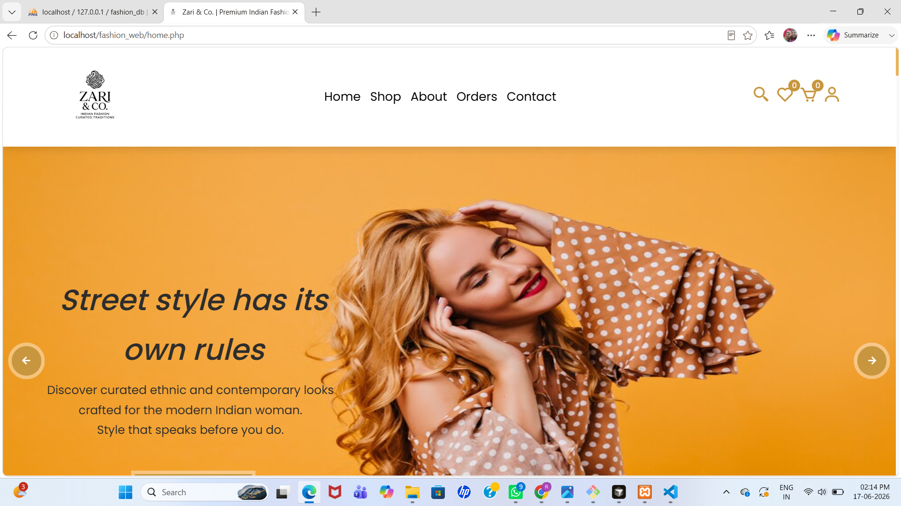
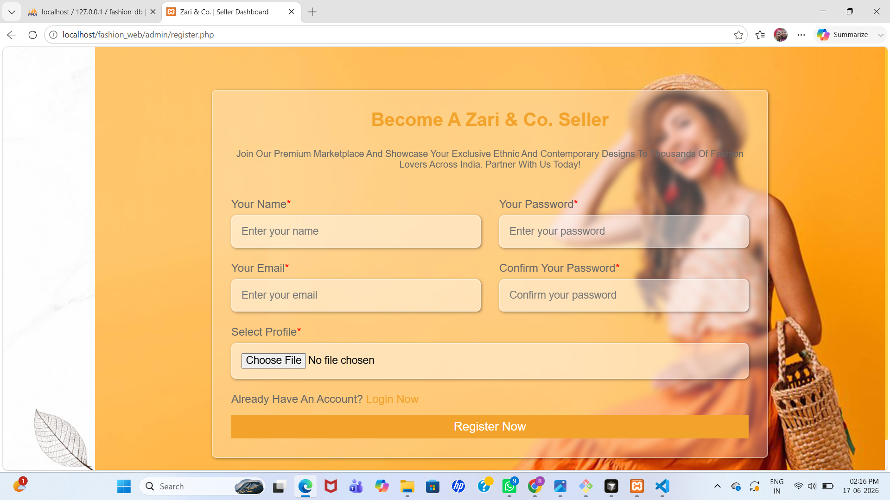

# Fashion Store 👗

A responsive fashion e-commerce website built using HTML, CSS, JavaScript, PHP, and MySQL.

## Features

* User Registration & Login
* Product Catalog
* Shopping Cart
* Wishlist
* Order Management
* Admin Dashboard
* Responsive Design

## Tech Stack

* HTML5
* CSS3
* JavaScript
* PHP
* MySQL
* XAMPP

## Screenshots

## Run Locally

1. Move the project to the XAMPP `htdocs` folder.
2. Start Apache and MySQL from XAMPP.
3. Import the database into phpMyAdmin.
4. Open:

`http://localhost/fashion_web/`

## Author

Riddhi Kulkarni
